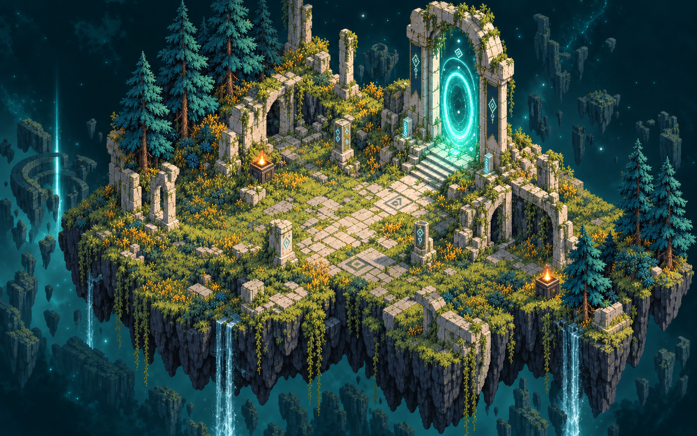

# Verso

A browser action adventure about borrowed lives, small interventions, and the worlds that bear their consequences. Enter your name, inhabit a host, complete an assignment, and return through the rift. Your intervention footprint matters as much as the objective.

This playable slice adapts the supplied **Verso Game Concept.pdf**, **Verso Game Concept.docx**, and **Verso.pptx**. [The source brief](docs/CONCEPT.md) records their shared ideas, differences, and the decisions behind this implementation.



*The Quiet Verge environment plate. The player, encounters, interactions, particles, and interface are rendered live during play.*

## Run locally

Use **Node.js 22.18 or newer** and npm.

```sh
npm install
npm run dev
```

Open **http://localhost:4173**. To run the production build:

```sh
npm run build
npm run preview
```

The preview opens at **http://localhost:4174**. Both ports are fixed; stop another process using the port before starting the server. The production output is in `dist/` and can be served by a static web server. Use a server rather than opening `index.html` directly.

All artwork is served locally and the soundtrack is synthesized in the browser. After installation and building, the game requires no external runtime libraries, asset hosts, accounts, or API services. Audio begins after a user gesture; headphones are recommended.

## Play

The opening chapter contains three assignments across three visual worlds:

1. **The Quiet Verge — survey.** Catalog three native species and return through the transfer gate. The opening assignment can be completed peacefully.
2. **The Violet Archive — adjustment.** Synchronize the three relays in the order supplied by the briefing, then extract.
3. **The Last Witness — retrieval.** Find the archivist, establish contact, and escort them to the gate.

Completing the chapter reveals who commissions these interventions and offers a choice: preserve the evidence and leave, or continue into seeded expeditions. Further expeditions reuse the assignment types with seeded encounter variation and bounded increases in danger.

Combat, mending, and host loss affect your record. If a host dies, another can continue the assignment and recover the fragments left behind. Debriefings and the field journal record species, assignment outcomes, world integrity, and lives ended.

| Control | Action |
| --- | --- |
| **W A S D** | Move |
| **Shift** | Run; consumes energy |
| **Mouse** | Aim |
| **Left mouse / F** | Blade attack |
| **Right mouse / R** | Ranged pulse |
| **Arrow keys** | Aim and fire a directional pulse |
| **Space** | Dash |
| **E** | Interact with the nearby prompt, or scan |
| **Q** | Mend |
| **J** | Field journal |
| **Esc** | Pause or close the current journal/pause panel |
| **M** | Toggle audio |

Touch devices have a movement joystick and on-screen action buttons. The pause menu includes the control reference. Leaving the game tab or moving focus to another window pauses play.

## Saves

Progress autosaves to this browser's local storage, including after important actions. Choose **Continue your assignment** on the title screen to resume. In the pause menu, **Download save** exports a JSON file and **Restore a save** imports one; invalid files leave the current run intact.

Saves belong to the browser and site address: `localhost` and `127.0.0.1`, or different ports, have separate storage. Export a save before changing addresses or clearing browser data. Your entered name and progress stay local; the game sends no personal information to a server.

## Verification

```sh
npm test
npm run build
# Both checks together:
npm run check
```

The engine tests cover mission progression, collision and movement, combat and consequences, relay order, escort behavior, recovery, seeded variation, and save validation. Building also checks TypeScript.

The real-input browser acceptance script uses an **isolated Agent Workspace Chromium**, with a loopback CDP endpoint supplied by that workspace:

```sh
# Start the production preview first, then substitute its workspace CDP port:
node scripts/browser-check.mjs http://127.0.0.1:CDP_PORT http://localhost:4174
```

The script exercises the chapter through mouse, keyboard, and touch events. It writes screenshots and detailed results to the ignored `.dream-loop/qa/` directory and a readable report to [docs/QA.md](docs/QA.md). The report states the tested viewports, results, and remaining gaps; passing the scripted route does not establish audio fidelity or every possible combat outcome.

## Project layout

```text
src/
  game.ts       Deterministic simulation, missions, combat, collision, saves
  render.ts     Canvas world, actors, animation, lighting, particles
  main.ts       Input, HUD, terminal panels, persistence, game loop
  audio.ts      Seeded Web Audio score and synthesized effects
  style.css     Responsive interface and touch layout
public/art/     Original generated environments and sprite assets
tests/          Engine regression tests
scripts/        Real-input browser acceptance check
docs/           Source brief, design notes, asset prompts, QA report
```

See [visual direction](docs/DESIGN.md), [biome prompts](docs/BIOMES.md), [sprite atlas notes](docs/EXPLORER-ATLAS.md), and [audio design](docs/AUDIO.md) for the implementation's art and sound decisions.

## Scope and next milestones

This is a compact single-player chapter with repeatable expeditions. Its three biome plates are **authored generated environments sharing a fixed collision layout**. Encounter details and the adaptive soundtrack use seeds; the terrain geometry is not generated procedurally at runtime.

The original concept's 15-hour campaign, multiplayer, infinite terrain generation, broad procedural equipment and character systems, persistent skill progression, and machine-learning adaptation remain future work. The browser slice uses a dash rather than a full jumping/ladder system. It does not yet provide gamepad controls, cloud saves, or a production content pipeline.
