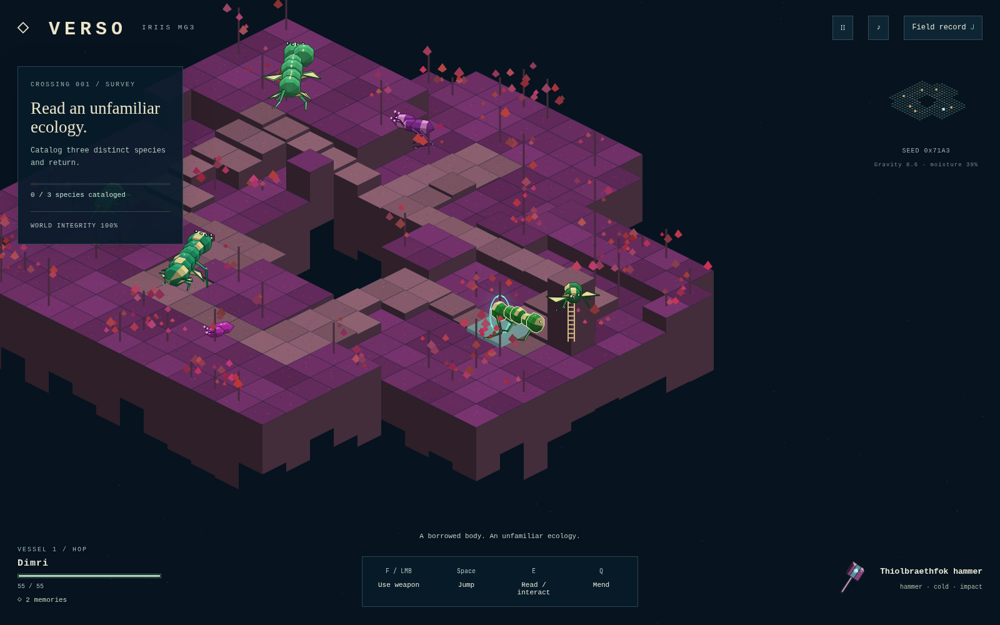

# Verso

A browser game about borrowed bodies, generated worlds, and the consequences of intervening in them.

The default game is now a **procedural foundation**. A seed generates world conditions, connected terrain, species body graphs, anatomy-dependent movement, assembled equipment, and compatible assignments. Your actions contribute to the next crossing's seed. The opening assignment is always exploration, as specified in the concept.

This is an early implementation of the supplied PDF, DOCX, and slides. It does **not** yet realize the full ambition of universally generated mechanics, ecosystems, stories, and physics. [The foundation guide](docs/PROCEDURAL-FOUNDATION.md) connects the implementation to the reread source material and records the remaining work.



## Play locally

Use Node.js 22.18 or newer.

```sh
npm install
npm run dev
```

Open **http://localhost:4173**. For a production build:

```sh
npm run build
npm run preview
```

Open **http://localhost:4174**. The production output in `dist/` works on a static web server, including a subpath. The game uses local code and browser-synthesized audio, without runtime account or API requirements.

Enter a number, hexadecimal seed, or a name. Try **0x71A3** and **0x2A**: the first produces a hopping host with five segments and a cold impact hammer; the second produces a skittering host with three segments and a projectile conduit. Native species and terrain also change. These examples refer to generator version 1.

## Controls

| Control        | Action                                                           |
| -------------- | ---------------------------------------------------------------- |
| WASD           | Move on the isometric ground plane                               |
| Shift          | Run                                                              |
| Space          | Jump, when the current anatomy supports it                       |
| Mouse          | Aim                                                              |
| F / left mouse | Use the issued object's effect                                   |
| E              | Read a lifeform, establish contact, recover memories, or extract |
| Q              | Mend using a memory                                              |
| J              | Field record: anatomy, equipment, native lineages                |
| Esc            | Pause or close a panel                                           |
| Mouse wheel    | Zoom                                                             |
| ♪ button       | Sound                                                            |

Touch devices have direction and action buttons. Walking into a ladder climbs it; walking off an unprotected edge can kill the host. Different bodies have different speed, jump capacity, and gait. When a host dies, borrow another generated body and recover its memories. Complete the assignment, then return to the rift.

The field record explains how the body's parts determine its properties and how an object's material, shape, core, and delivery rule determine its effect. Equipment can deliver impact, projectiles, or fields; heat burns, cold slows, charge interacts with conductors, and growth heals.

## What is generated

- **Worlds:** environmental parameters, room graphs, connecting corridors, elevations, surface detail, vegetation geometry, and placement.
- **Species and hosts:** connected and sometimes branching body graphs, variable appendage counts and proportions, sensory traits, material affinity, capabilities, and roles. Their silhouettes are drawn from geometry.
- **Movement:** articulated stride, skitter, hop, slither, or hover selected from anatomy. Distance-driven gait phases and inverse kinematics pose limbs; the gameplay root uses kinematic movement and gravity.
- **Equipment:** a structural frame combined with sampled matter, shape, an active core, and a delivery rule. These control actual damage/healing, range, handling, and effect.
- **Assignments:** a bounded vocabulary of survey, escort, attune, and hunt, bound to the generated inhabitants and issued object. This is not yet a general causal quest planner.
- **Audio:** seeded Web Audio synthesis with gameplay-responsive layers, currently inherited from the earlier slice.

Generators use versioned 32-bit seed descriptors and addressed random streams. This gives reproducibility and compositional variation within defined rules, not unlimited content or a guarantee that every possible seed is interesting. Some ecological capability labels describe future interactions; the current simulation implements wandering, pursuit, escort, and equipment responses.

## Progress and offline play

The default game autosaves locally. **Continue your crossing** restores its current world, body, position, objective progress, and consequences. Saves belong to the browser and address; `localhost`, `127.0.0.1`, and different ports have separate storage. The new game uses a separate save key from the earlier visual study.

Production includes a service worker. A complete first online load caches the build for offline reload. Existing sessions are allowed to finish before an update activates. The new foundation currently has no save-file import/export or controller integration.

## Tests

```sh
npm test
npm run build
npm run format:check
```

**99 tests pass**, including **31 new procedural tests**. They cover anatomy constraints, reachable limb lengths, five motion strategies, functional equipment combinations, 100 connected generated worlds, ladder traversal, jumping and falling, escort detours, mission completion, history-dependent seeds, and memory conservation after death.

The isolated workspace browser test uses actual keyboard and mouse inputs with read-only diagnostics:

```sh
node scripts/browser-procedural-check.mjs http://127.0.0.1:CDP_PORT http://localhost:4174/
```

See [procedural browser QA](docs/PROCEDURAL-QA.md) for tested flows, screenshots, measured performance, and limits. The earlier slice's [QA](docs/QA.md), [storage checks](docs/STORAGE-QA.md), [controller checks](docs/GAMEPAD-QA.md), and [soak tests](docs/ROBUSTNESS.md) apply to that implementation, not automatically to the new one.

## Code and direction

```text
src/procedural/
  schema.ts    Shared world, anatomy, equipment, and pose contracts
  random.ts    Seed derivation and deterministic random streams
  compose.ts   World laws, functional species and equipment composition
  world.ts     Terrain topology, placement, and assignment generation
  motion.ts    Anatomy-dependent gait and two-bone IK
  draw.ts      Geometric body and equipment rendering
  session.ts   Movement, interactions, effects, missions, consequences
  app.ts       Browser loop, projection, controls, HUD, local persistence
  style.css    Responsive interface
src/entry.ts   Default procedural entry; ?study=1 opens the earlier study
```

[Procedural motion research](docs/research/PROCEDURAL-MOTION.md) records the primary sources and mathematics behind the approach. The next substantial systems are broader body and behavior grammars, persistent terrain contacts, physical object construction, causal ecology and mission planning, and procedural progression and narrative.

The earlier polished chapter remains at **[http://localhost:4174/?study=1](http://localhost:4174/?study=1)** as a visual and interaction reference. Its authored environment plates and fixed characters do not form the new procedural content pipeline. [Historical study documentation](docs/VISUAL-STUDY.md) preserves its controls and features.
